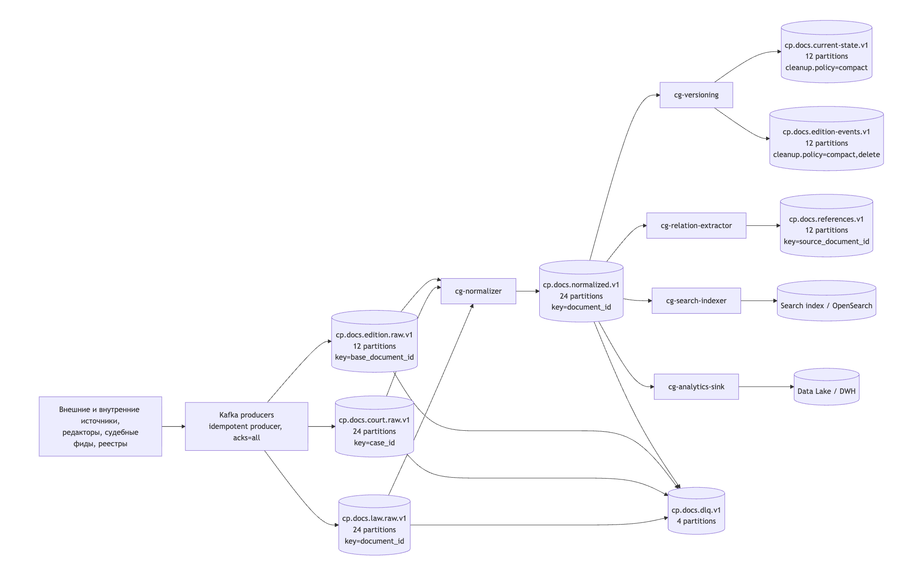

# Kafka-пайплайн для обработки документов в Консультант Плюс

## 1. Цель

Необходимо составить схему Kafka-пайплайна для обработки юридических документов: законов, судебных решений, редакций документов, ссылок между документами и служебных событий.  
Архитектура разделяет потоки по бизнес-сущностям, сохраняет порядок внутри одного документа, позволяет масштабировать обработку по горизонтали и отдельно настраивать хранение для разных классов данных. Решении опирается на базовые сущности Kafka: сообщения, топики, партиции, consumer group, ключ сообщения, репликацию и политики очистки журнала, а также на различие между `delete` и `compact`, `acks`, `replication factor`, `min.insync.replicas` и транзакциями. 

---

## 2. Схема

---

## 3. Разбиение на топики

### 3.1. Сырые потоки
**`cp.docs.law.raw.v1`**  
Попадают исходные события по законам и нормативным актам.

**`cp.docs.court.raw.v1`**  
Попадают судебные решения, определения, постановления.

**`cp.docs.edition.raw.v1`**  
Попадают редакции документов, то есть события создания/изменения/аннулирования версий.

Почему так: разные источники имеют разный темп поступления, разную семантику и разные требования к обработке. Разделение снижает связанность, упрощает мониторинг и позволяет независимо масштабировать каждую ветку.

### 3.2. Нормализованный поток
**`cp.docs.normalized.v1`**  
После первичной валидации и приведения к единой схеме все документы идут в единый нормализованный поток.

### 3.3. Потоки состояния и истории
**`cp.docs.current-state.v1`**  
Хранит только актуальное состояние документа по ключу документа. Это компактированный topic.

**`cp.docs.edition-events.v1`**  
Хранит события версий документа, чтобы можно было восстановить историю изменений.

### 3.4. Производные потоки
**`cp.docs.references.v1`**  
Содержит связи между документами: ссылки, цитирования, отсылки на судебную практику, пересечения между актами.

**`cp.docs.dlq.v1`**  
Сюда уходят некорректные или неразбираемые сообщения.

---

## 4. Партиционирование и ключи

### 4.1. Принцип выбора ключа
Ключ должен обеспечивать одно и то же место хранения для событий одного логического объекта. Это сохраняет порядок обработки внутри одного документа и позволяет собирать историю изменений без гонок. В Kafka именно ключ определяет, в какую партицию попадёт сообщение, а consumer group позволяет независимо масштабировать чтение. 

### 4.2. Количество партиций

| Топик | Партиции | Ключ | Причина |
|---|---:|---|---|
| `cp.docs.law.raw.v1` | 24 | `document_id` | Высокая конкуррентность, нужны параллельные consumers |
| `cp.docs.court.raw.v1` | 24 | `case_id` | Судебный поток не меньше по объёму, нужен запас по масштабированию |
| `cp.docs.edition.raw.v1` | 12 | `base_document_id` | Для документа важен порядок версий |
| `cp.docs.normalized.v1` | 24 | `document_id` | Равномерное распределение нагрузки на downstream |
| `cp.docs.current-state.v1` | 12 | `document_id` | Компактированное состояние, меньше горячих партиций |
| `cp.docs.edition-events.v1` | 12 | `base_document_id` | История версий должна идти строго по документу |
| `cp.docs.references.v1` | 12 | `source_document_id` | Связи удобно строить от источника ссылки |
| `cp.docs.dlq.v1` | 4 | `document_id` или `error_hash` | DLQ не должен быть основным горячим потоком |

### 4.3. Почему такие числа
24 партиции для потоков с наибольшей нагрузкой дают хороший запас по параллелизму.  
12 партиций для состояний и историй достаточно, потому что эти ветки обычно уже не являются первичной точкой входа и нагрузка на них ниже.  
4 партиции для DLQ достаточно, потому что это аварийный канал, а не основной рабочий поток.

Если кластер из 3 брокеров, то 24 партиции дают нормальное распределение нагрузки по брокерам и не раздувают overhead чрезмерно. Репликация при этом остаётся отдельным механизмом надёжности.

---

## 5. Политики хранения

В лекции отдельно разобраны две базовые политики очистки журналов: удаление (`delete`) и сжатие (`compact`), а также параметры retention. Для этой задачи лучше использовать обе стратегии, но в разных слоях пайплайна. 

### 5.1. Сырые топики
Для `*.raw`:
- `cleanup.policy=delete`
- `retention.ms=604800000` — 7 дней
- при необходимости можно поднять до 14 дней

Смысл: сырые события нужны как буфер на случай сбоя, но не должны храниться бесконечно.

### 5.2. Нормализованный поток
Для `cp.docs.normalized.v1`:
- `cleanup.policy=delete`
- `retention.ms=2592000000` — 30 дней

Смысл: нормализованный поток нужен для переобработки и контроля качества, но его тоже можно ограничивать по времени.

### 5.3. Текущее состояние документа
Для `cp.docs.current-state.v1`:
- `cleanup.policy=compact`
- tombstone-сообщения использовать для удаления записи по ключу

Смысл: в этом topic важна последняя версия документа, а не вся история.

### 5.4. История редакций
Для `cp.docs.edition-events.v1`:
- `cleanup.policy=compact,delete`
- `retention.ms=15552000000` — 180 дней или больше

Смысл: нужно сохранить историю версий, но при этом не раздувать объём бесконечно.  
Если требуется полноценный долгий юридический архив, историю лучше дополнительно выгружать в Data Lake или включать tiered storage.

### 5.5. Справочные и производные потоки
Для `cp.docs.references.v1`:
- `cleanup.policy=delete`
- `retention.ms=7776000000` — 90 дней

Смысл: связи можно пересобрать из исходных данных, поэтому длительное хранение не обязательно.

### 5.6. DLQ
Для `cp.docs.dlq.v1`:
- `cleanup.policy=delete`
- `retention.ms=2592000000` — 30 дней

Смысл: ошибок должно быть немного, но их нужно успеть разобрать и переделать вручную или отдельным replay-job.

---

## 6. Гарантии доставки

Для юридического домена оптимален режим, близкий к `at least once`, а для внутренних стадий — транзакционная обработка. 

### 6.1. Продюсер
Рекомендация:
- `enable.idempotence=true`
- `acks=all`
- `retries` включены
- `max.in.flight.requests.per.connection` ограничен так, чтобы не ломать порядок при ретраях

Это минимизирует риск потери данных и дубликатов при сетевых сбоях.

### 6.2. Репликация
Рекомендация:
- `replication.factor=3`
- `min.insync.replicas=2`

Это даёт баланс между доступностью и надёжностью. Если один брокер падает, топик продолжает работать.

### 6.3. Семантика обработки
Для обычной бизнес-обработки:
- семантика `at least once`
- consumer читает сообщение, обрабатывает его, затем коммитит offset

Для критичных цепочек Kafka --> Kafka:
- использовать транзакции
- читать из одного topic и писать в другой в одной транзакции

### 6.4. Как бороться с дубликатами
Поскольку `at least once` допускает повторную доставку, downstream-сервисы должны быть идемпотентными:
- хранить `event_id`
- проверять `document_id + version`
- не выполнять повторно уже применённую операцию

### 6.5. Порядок обработки
Порядок внутри одного документа обеспечивается ключом: все события одного `document_id` или `base_document_id` попадают в одну партицию. Это особенно важно для редакций и статусов документа. 

---

## 7. Группы потребителей

В Kafka каждая группа потребителей читает свой поток независимо, а `group_id` определяет, откуда группа получает сообщения. Это удобно использовать для раздельной бизнес-логики. 

### 7.1. Предлагаемые consumer groups

**`cg-normalizer`**  
Парсит, валидирует и приводит все документы к единой схеме.

**`cg-versioning`**  
Собирает историю редакций, пишет текущее состояние и события версий.

**`cg-relation-extractor`**  
Извлекает связи между документами и судебную цитируемость.

**`cg-search-indexer`**  
Пишет данные в поисковый индекс, например OpenSearch или Elasticsearch.

**`cg-analytics-sink`**  
Отгружает очищенные данные в Data Lake / DWH для аналитики и ML.

**`cg-replay-recovery`**  
Читает DLQ и аварийные потоки для повторной обработки.

### 7.2. Зачем столько групп
Такой набор даёт слабую связанность:
- индексирование не блокирует нормализацию;
- аналитика не мешает выдаче в поиск;
- история версий не зависит от extractor’а связей;
- DLQ можно разбирать отдельно, без остановки основного потока.

---

## 8. Описание потоков по шагам

1. Источники данных публикуют события в raw topics.  
2. `cg-normalizer` забирает сырые данные, проверяет схему, преобразует формат и отправляет в `cp.docs.normalized.v1`.  
3. `cg-versioning` строит текущую версию и историю редакций.  
4. `cg-relation-extractor` выделяет ссылки, отсылки и перекрёстные связи.  
5. `cg-search-indexer` обновляет поисковый индекс.  
6. `cg-analytics-sink` выгружает данные в хранилище для аналитики и отчётности.  
7. Все невалидные сообщения попадают в DLQ.  
8. Отдельный replay-job может исправить данные и вернуть их в основной поток.

---

## 9. Почему это хороший вариант для Консультант Плюс

Для справочно-правовой системы важны три свойства: порядок внутри документа, воспроизводимость истории и высокая доступность поиска.  
Поэтому:
- ключом делаем логический идентификатор документа;
- raw и normalized слои держим ограниченное время;
- актуальное состояние храним через compaction;
- историю версий сохраняем отдельным потоком;
- поиск и аналитика получают свои consumer groups;
- репликацию настраиваем с запасом по отказоустойчивости.

## 10. Итог

Подготовлена схема Kafka-пайплайна, разбиение на топики, рекомендации по партициям и ключам, политики хранения, гарантии доставки и перечень consumer groups.  
Вся логика построена так, чтобы сохранить порядок редакций, обеспечить надёжность обработки и дать системе возможность масштабироваться без потери управляемости. 
